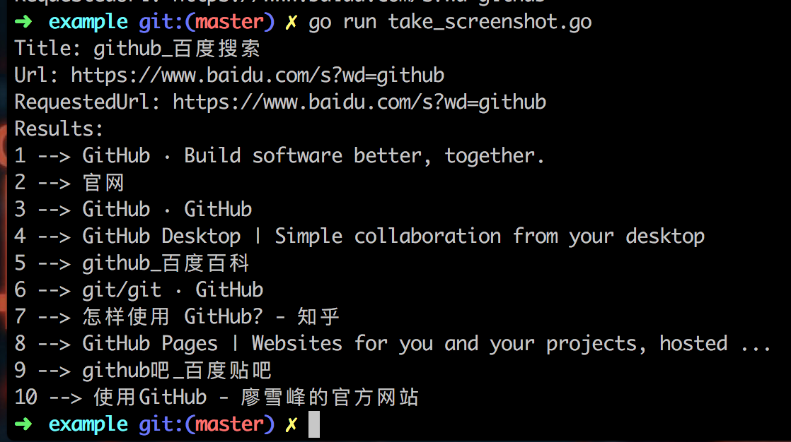

# go-splash
a simple wrapper for [Splash](https://github.com/scrapinghub/splash) HTTP API.

## Installation
### Install Splash
``` sh
docker pull scrapinghub/splash
```
### Clone the Source
``` sh
go get github.com/PuerkitoBio/goquery # used in example
go get github.com/nladuo/go-splash
```

## Example
Take screenshot for "https://www.baidu.com/s?wd=github"
### 1.Start the container
``` sh
docker run -p 8050:8050 scrapinghub/splash
```
### 2.Run the script
``` sh
cd $GOPATH/src/github.com/nladuo/go-splash/example # enter the directory
go run take_screenshot.go                          # run the script
ll | grep baidu_github.png                         # see the screenshot
```


## LICENSE
MIT
