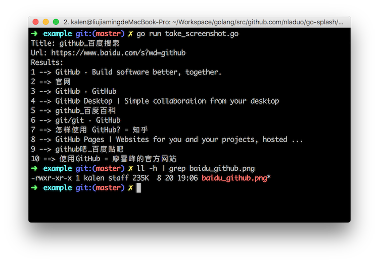

# go-splash
a simple wrapper for [Splash](https://github.com/scrapinghub/splash) HTTP API.

## Installation
### Install Splash
``` sh
docker pull scrapinghub/splash
```
### Clone the Source
``` sh
go get github.com/nladuo/go-phantomjs-fetcher
```

## Example
### Take Screenshot
Take screenshot for "https://www.baidu.com/s?wd=github"
``` sh
cd $GOPATH/src/github.com/nladuo/go-splash/example # enter the directory
go run take_screenshot.go                          # run the script
ll | grep baidu_github.png                         # see the screenshot
```


### Run JS Script
Use js script to mock clicking search button on baidu.com.
``` sh
cd $GOPATH/src/github.com/nladuo/go-splash/example # enter the directory
go run run_js_script.go                          # run the script
```
## LICENSE
MIT
